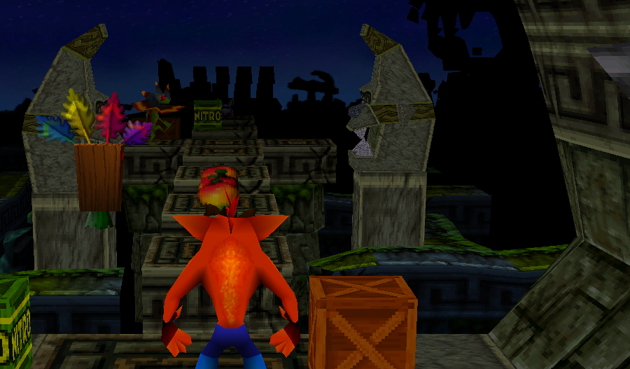
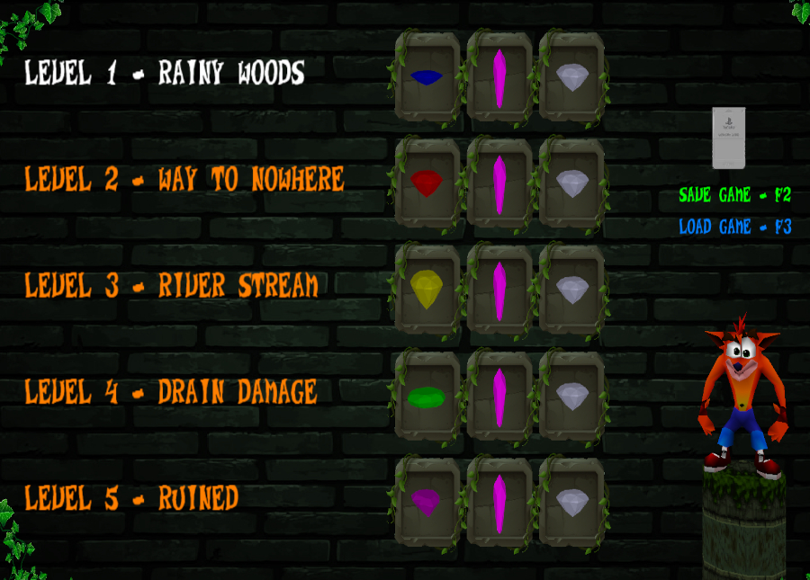
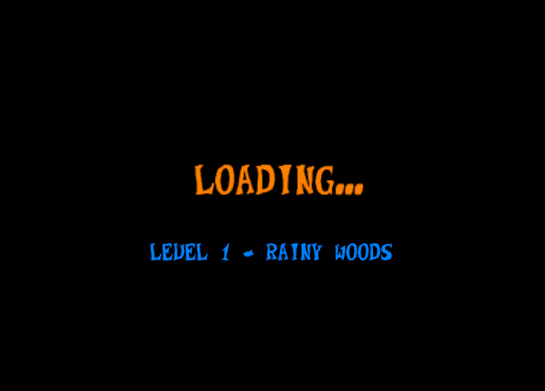
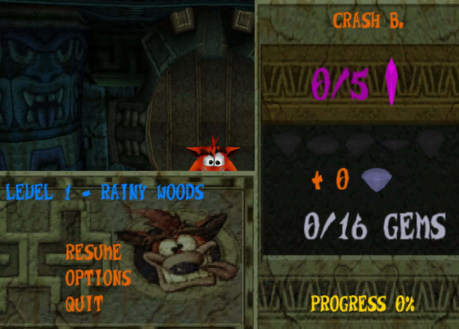
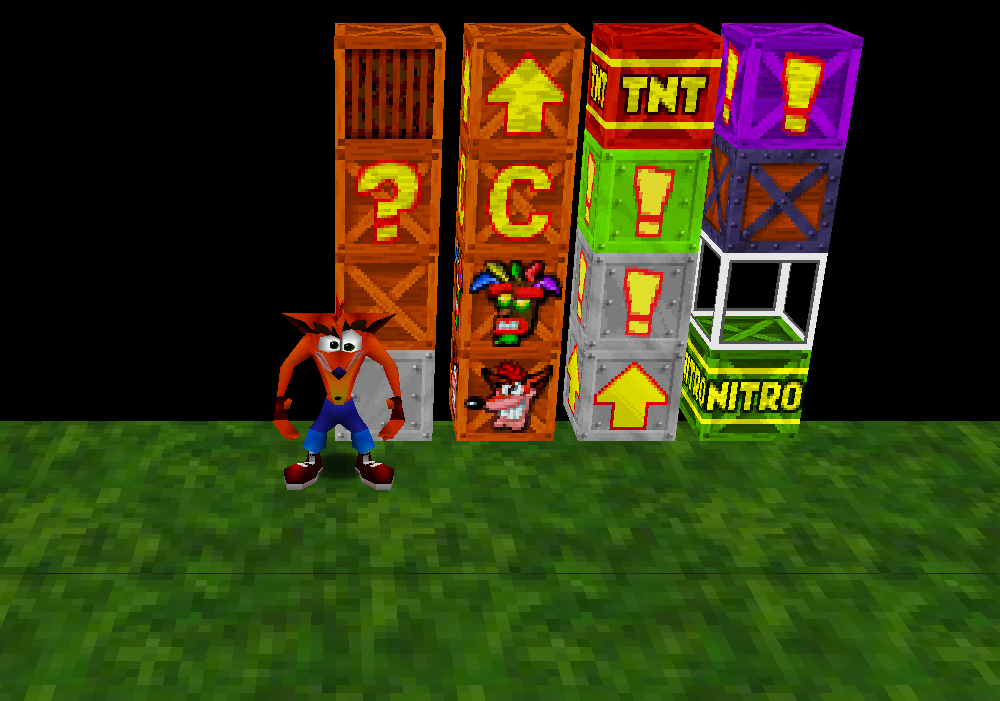
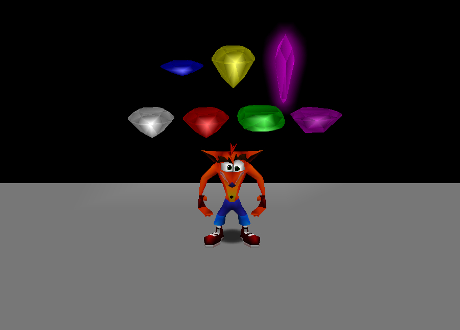

Information: This Project is a Cube based Crash Bandicoot inspired Game written in Python3 (Ursina 7.0.0)
<table>
  <tr>
    <td></td>
    <td></td>
    <td></td>
  </tr>
  <tr>
    <td></td>
    <td></td>
    <td></td>
  </tr>
  <tr>
    <td></td>
    <td></td>
    <td></td>
  </tr>
  <tr>
    <td></td>
    <td></td>
    <td></td>
  </tr>
  <tr>
    <td></td>
  </tr>
</table>

# temporary no Assets and Ressources aviable, will shortly aviable restricted! (some pcv files will put all Data together), a installations key will required to read the Game Data #
# HOW TO USE CRASH EDIT / CB-EXPORT: https://www.youtube.com/watch?v=ct_G9GAoAZU #

# Functional Status: Modern PC's will run this Game with 200-300 (full loaded Game with 300-400) MB RAM per Level and 59-60 FPS
# LEVEL CREATOR beta implemented (25.01.2025) for easy making 2D/3D Levels
# Game final Progress: Tested 5/8 Levels for 100% Completion and no gamebreaking Glitches or Issues found.

required Modules:
- ursina
- imageio

optional for help scripts:
- pyautogui

to install this Modules you need Python3 installed on your Computer and then type in your commandline:

pip install ursina --upgrade

important: if ursina-version about 7.0.0 and some issue happen, then install
directly ursina 7.0.0 by typing: pip install ursina==7.0.0

Sound Issue: If you plug in a Sound output Device, while the Game run, then
you need to restart the Game to get Sound. If you pull out Cable from your 
Headset, while the Process runs, then the Game will lagg and spam a lot of
Error results in console. Make sure that your Output Devices is connected before
you start this Game.

pip install imageio --upgrade

After Install, download the ZIP File and extract them into a emtpy Folder.
execute the Launcher by executing the "main.pyw" by clicking it or starting by
commandline by typing in the same Directory as the script: "python3 main.pyw" or "python main.pyw"

Which Tools required? here you can Download all important Tools:

CrashEdit: https://github.com/cbhacks/CrashEdit ### View 3D Models and Animations, Scenerys, Chunks, Textures and play Sounds, for stable version check the issue section for this Reposity!

CBExport:  https://github.com/warenhuis/Crash-Bandicoot-2-Modelexport ### exporter for Animations and compressed Models

Crash-NSF: https://github.com/dehodson/crash-bandicoot-nsf ### load NSF Files into Memory

Level ID:  https://crash-hacking.fandom.com/wiki/Level_ID ### list of all level files

Avocado:   https://github.com/JaCzekanski/Avocado ### This Emulator have a 3D Screenshot Function, that makes easier, to clone Textures and smaller 3DModels

i will update weekly the Template Folder, which contains a lot of time saving Mechanics and easy to understand und build in.
in the script folder you can find a Tool, that makes automatic export.

The Main Project Folder contains my own Version of this Game, which im showing on Youtube. This is only used to compare a functional version of the game.
You can modify this Code to make your own System.
